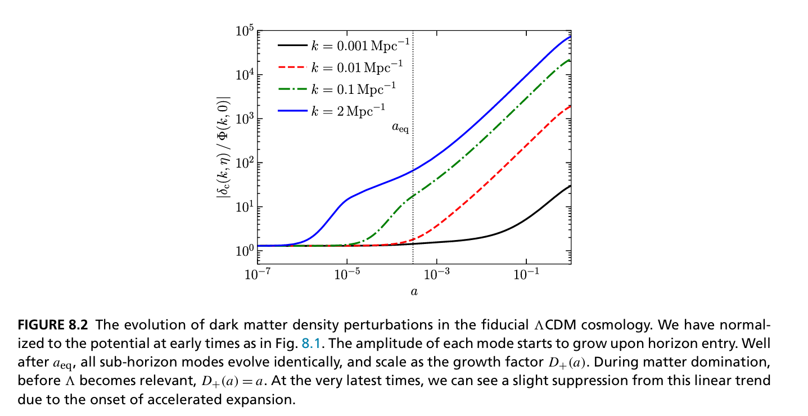

# Linear Growth of Matter Perturbations
Author: João Rebouças, April 2025

The growth of matter perturbations is one of the key theoretical predictions in cosmology and is closely related to many observables, such as cosmic shear, galaxy clustering (and their cross-correlations), and CMB lensing. This project implements a simple cosmological perturbation integrator (the Jupyter notebook [`growth.ipynb`](./growth.ipynb)) to investigate how matter perturbations grow in the linear regime. A simple goal is to reproduce Figure 8.2 from Modern Cosmology ed. 2, by Scott Dodelson and Fabian Schmidt.

    

References:
- [Cosmological Perturbation Theory in the Synchronous and Conformal
 Newtonian Gauges](https://arxiv.org/pdf/astro-ph/9506072), by Chung-Pei Ma and Edmund Bertschinger.
- [Modern Cosmology, Second Edition](https://ui.adsabs.harvard.edu/abs/2020moco.book.....D/abstract), by Scott Dodelson and Fabian Schmidt.